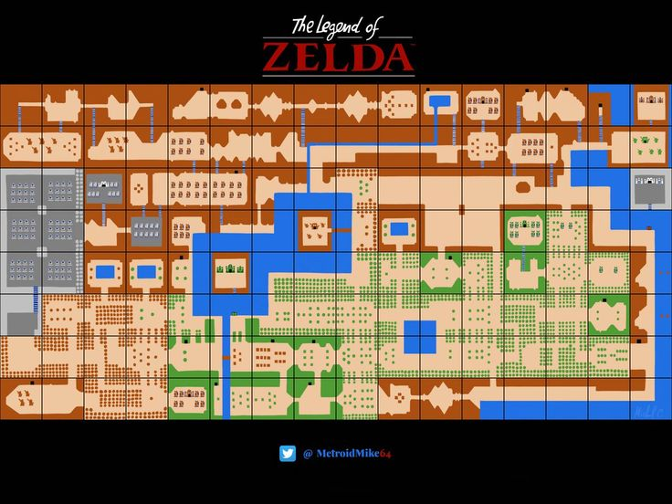
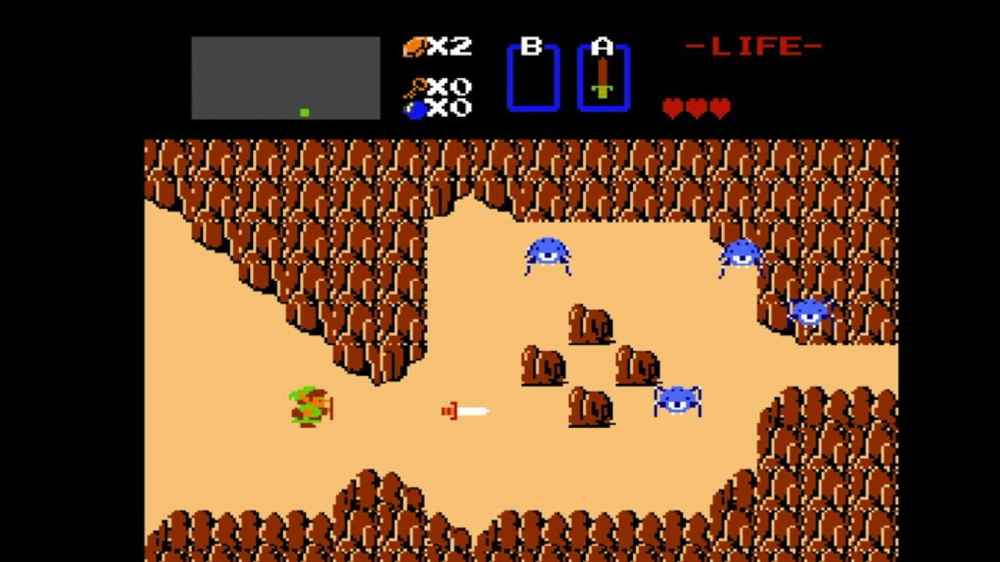

= 2DRPG
Sukhbad Munkh, Schnalzenberger Arwed
:description: 2DRPG
:sectanchors:
:sectnums:
:url-repo: https://github.com/SukhbatMunkh/2DRPG

== Short Description
We are going to code a 2 dimensional RPG (RolePlayGame) which is based on the original Zelda game. The story is a typical dungeon-type story. We are going to use Java, Javafx and an Apache Derby database.

== Rough Plan
* everything is going to be started as simple as possible, and we will see what and where we can upgrade things over time. So for example we will first focus on getting ourselves a player which can walk through a blank scene

* The map is going to be made of several scenes

* source: https://i.pinimg.com/736x/cc/0f/2b/cc0f2b0b65cd05e691bce90b89029501.jpg

* each scene has Blocks, Mobs and an id

* source: https://i.ytimg.com/vi/996tpMe4Qr4/maxresdefault.jpg

* The player will be able to move to the next scene by walking towards the side of one scene

* The player will naturally be able to defeat monsters and get items to heal themselves. There will also be some possibilities to get extra hearts which will most likely be found in chests

* We also plan to make some simple items like keys and also some simple skills

* when the game gets player input the controller takes care of that and makes the corresponding action

* This all takes place in a kind of dungeon

=== Classes (structure)
(not complete)
[plantuml,ucd,png]
----
include::puml/classOverview.puml[]
----